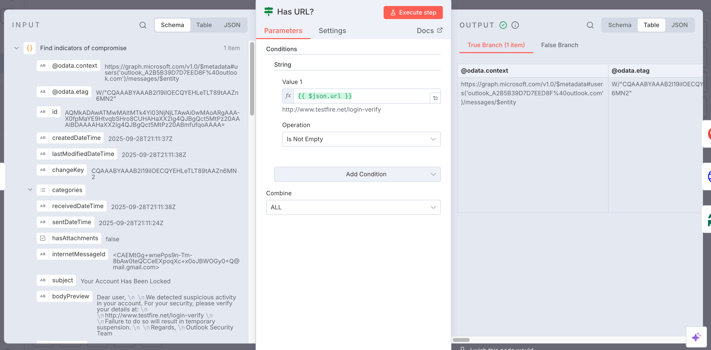

## Automated Phishing Analysis Workflow (n8n + URLScan.io + VirusTotal)

This project contains an **end-to-end automated phishing detection workflow** built with [n8n](https://n8n.io).  
It integrates **Outlook**, **URLScan.io**, **VirusTotal**, and **Slack** to detect, analyze, and report suspicious URLs found in phishing emails.

---

## Workflow

- Fetches unread emails from Outlook.
- Extracts URLs from message bodies (Indicators of Compromise).
- Submits URLs to [URLScan.io](https://urlscan.io) for scanning & screenshot evidence.
- Submits URLs to [VirusTotal](https://www.virustotal.com) for phishing/malware analysis.
- Merges both reports for context-rich results.
- Posts summary reports in Slack (subject, sender, URL, verdict).

---

##  Workflow Architecture

---

##  Workflow Breakdown

### 1. **Triggering**
- **Schedule Trigger** → Runs every 5 minutes (configurable).  
- **Manual Trigger** → For on-demand execution.

 Screenshot: 

---

### 2. **Email Ingestion**
- **Get all unread messages** (Outlook).  
- **Mark as read** → Ensures no duplicate processing.  

📸 Screenshot:  
  

---

### 3. **IOC Extraction**
- **Split in Batches** → Process each email individually.  
- **Find indicators of compromise** → Extracts URLs using regex.  
- **Has URL?** → Skip emails without URLs.  

📸 Screenshot:  
  

---

### 4. **URL Scanning**
- **URLScan: Scan URL** → Submit suspicious link.  
- **No error?** → Continue workflow even if scan fails.  
- **Wait 1 Minute** → Allow report generation.  
- **URLScan: Get report** → Fetch results.  

📸 Screenshot:  
  
  

---

### 5. **Phishing Analysis**
- **VirusTotal: Scan URL** → Submit for analysis.  
- **VirusTotal: Get report** → Retrieve verdicts.  

📸 Screenshot:  
  

---

### 6. **Report Aggregation**
- **Merge Reports** → Align URLScan + VirusTotal results.  
- **Not Empty?** → Ensure valid results exist.  

📸 Screenshot:  

---

### 7. **Slack Notifications**
- Sends formatted report with:
  - Subject, Sender, Date  
  - Extracted URL  
  - URLScan result & screenshot  
  - VirusTotal verdict (malicious/suspicious count)  

📸 Screenshot:  

---

