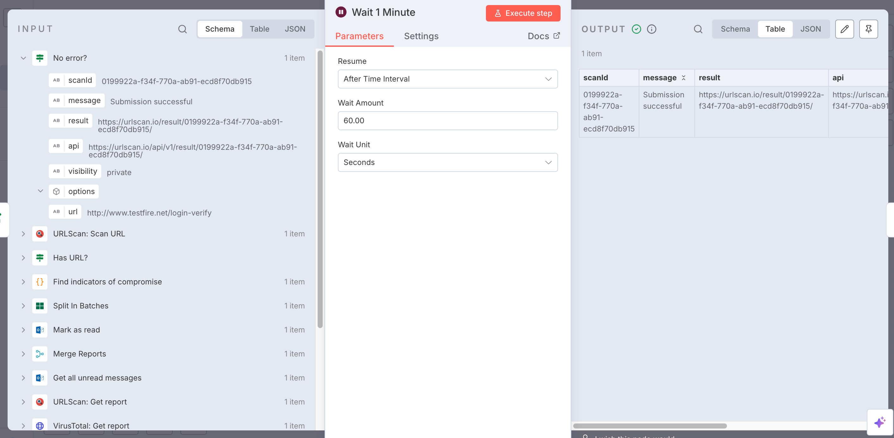

## Automated Phishing Analysis Workflow (n8n + URLScan.io + VirusTotal)

This project contains an **end-to-end automated phishing detection workflow** built with [n8n](https://n8n.io).  
It integrates **Outlook**, **URLScan.io**, **VirusTotal**, and **Slack** to detect, analyze, and report suspicious URLs found in phishing emails.

---

## Workflow

- Fetches unread emails from Outlook.
- Extracts URLs from message bodies (Indicators of Compromise).
- Submits URLs to [URLScan.io](https://urlscan.io) for scanning & screenshot evidence.
- Submits URLs to [VirusTotal](https://www.virustotal.com) for phishing/malware analysis.
- Merges both reports for context-rich results.
- Posts summary reports in Slack (subject, sender, URL, verdict).

API Keys required
- URLscan.io
- VirusTotal
- Slack

## Skills Gained
By completing this project, I gained hands-on experience in:

- **Security Automation & Orchestration (SOAR)**
  - Building automated phishing detection pipelines using n8n.
  - Integrating multiple security APIs (URLScan.io, VirusTotal).

- **Email Security & Threat Analysis**  
  - Extracting Indicators of Compromise (IOCs) such as suspicious URLs.  
  - Automating phishing triage from Outlook inboxes. 

- **API Integration & Data Handling**  
  - Working with REST APIs, authentication, and JSON parsing.  
  - Combining results from multiple sources (URLScan.io + VirusTotal).

- **Incident Response Reporting**  
  - Generating structured phishing reports.  
  - Sending near real-time notifications to Slack for fast response. 

---

##  Workflow Architecture

1. **Schedule Trigger** → Runs periodically or manually.  
2. **Email Ingestion** → Get unread Outlook messages → Mark as read.  
3. **IOC Extraction** → Split in batches → Extract URLs with regex → Skip empty.  
4. **URL Scanning** → Submit to URLScan.io → Wait 1m → Fetch report.  
5. **Phishing Analysis** → Submit to VirusTotal → Get verdicts.  
6. **Merge Reports** → Combine URLScan + VirusTotal data.  
7. **Slack Notifications** → Post results to a configured channel.  

---

##  Workflow Breakdown

### 1. **Schedule Trigger**
Using a schedule ensures the workflow runs consistently without manual intervention. Manual trigger is useful when testing API integrations, or Slack formatting without waiting for the next cycle.  

- **Schedule Trigger** - Runs every 5 minutes (configurable).  
- **Manual Trigger** - For on-demand execution.

 Screenshot: 

---

### 2. **Email Ingestion**
This stage ensures the workflow only analyzes fresh phishing emails and avoids duplicate reporting. Using Outlook OAuth2 ensures secure access to the mailbox.  

- **Get all unread messages** (Outlook).  
- **Mark as read** - Ensures no duplicate processing.  

📸 Screenshot:  
  

---

### 3. **IOC Extraction**
- **Split in Batches** - Processes one email at a time, keeping workflow execution clean.  

![Split In Batches] (images/SplitinBranches.png)

- **Find indicators of compromise** - Extracts URLs using regex (Javascript).  

  

- **Has URL?** - Skip emails without URLs.  
  

---

### 4. **URL Scanning**

- **URLScan: Scan URL** - Submits suspicious links to URLScan.io sandbox.  

  

- **No error?** - Handles failed submissions gracefully and prevents workflow breaks. 

  

- **Wait 1 Minute** - Allows time for URLScan.io to generate the report. The 60-second delay ensures URLScan.io has time to complete scanning before results are pulled.

  

- **URLScan: Get report** - Retrieves detailed scan results, including screenshot and DOM.   

---

### 5. **Phishing Analysis**
VirusTotal provides reputational scoring and confirms whether the link is flagged as malicious, suspicious, or clean. Combining this with URLScan.io provides both technical behavior and reputational context.  

- **VirusTotal: Scan URL** - Submit for analysis. 

  
 
- **VirusTotal: Get report** - Retrieve verdicts.  

---

### 6. **Report Aggregation**
This step ensures Slack only receives consolidated and useful reports. The `Not Empty?` check prevents false or empty alerts that would clutter the Slack channel.  

- **Merge Reports** - Combines URLScan.io and VirusTotal outputs into a single object. 

- **Not Empty?** - Ensure valid results exist.  

---

### 7. **Slack Notifications**
Slack provides instant visibility to the security team. Formatting the alert with clear sections and fallback values (“N/A”) ensures analysts get actionable context at a glance.  

- Sends formatted report with:
  - Subject, Sender, Date  
  - Extracted URL  
  - URLScan result & screenshot  
  - VirusTotal verdict (malicious/suspicious count)  

📸 Screenshot:  

---

## Limitations & Future Improvements

While this workflow demonstrates a functional phishing analysis pipeline, there are several limitations and areas where it could be improved:

### Current Limitations
- **IOC Scope** - Only URLs are extracted; other IOCs like attachments, IP addresses, or domains are not analyzed.  
- **False Positives** - Regex extraction may capture safe URLs (e.g., internal links) and send them for unnecessary scanning.  
- **Error Handling** - URLScan/VirusTotal failures are partially handled, but additional retries and logging could make the workflow more robust.  
- **Scalability** - Designed for a single mailbox and moderate email volume; may need optimization for enterprise-scale deployment.  
- **Contextual Enrichment** - Reports are limited to URLScan.io and VirusTotal verdicts; no integration with threat intel platforms (e.g., AbuseIPDB, OTX, MISP).  

### Future Improvements
- **Broader IOC Coverage** - Add additional support for extracting attachments, hashes, and suspicious sender domains.  
- **Threat Intelligence Enrichment** - Enrich reports with external feeds (AbuseIPDB, AlienVault OTX, MISP) for richer context.  
- **Enhanced Slack Reporting** - Include screenshots inline, add severity scoring, and group multiple IOCs per email into a single summary.  
- **Database/Case Management Integration** - Store results in a SIEM, SOAR, or case management system (TheHive, Splunk, ELK).  
- **Advanced Filtering** - Use allow/block lists or machine learning models to reduce noise from benign URLs.  
- **Multi-Channel Alerts** - Extend notifications beyond Slack (e.g., Teams, Email, PagerDuty).  

---

